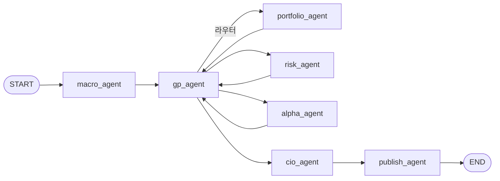

# AlphaInvest 코드베이스 개요

이 문서는 저장소 내 **모든 `.py` 파일**의 역할과, 애플리케이션 **전체 실행 흐름**을 한곳에서 파악하기 위한 참고용 요약입니다.

---

## 1. 한눈에 보는 실행 흐름

애플리케이션의 기본 경로는 **LangGraph**로 정의됩니다. `main.py`가 `build_skeleton()`으로 컴파일된 그래프를 스트리밍 실행합니다.

- **분석 순서**: Macro → Portfolio → Risk → Alpha → CIO → Publish  
- 각 분석 노드 **직후** 항상 **GP(검수/수정)** 노드로 들어가며, `gp_router`가 `last_node`를 보고 다음 분석 노드 또는 CIO로 분기합니다.  
- CIO는 네 에이전트 결과를 합쳐 `final_report`를 만들고, Publish가 Notion에 올려 `notion_page_url`을 채웁니다.

---

## 2. 디렉터리와 책임

| 경로 | 역할 |
|------|------|
| `main.py` | CLI 진입점, `.env` 로드, 초기 state 생성, 그래프 스트림·로깅 |
| `agents/` | LangGraph 상태·상수·워크플로 정의 및 노드(에이전트) 구현 |
| `data/` | 외부 API 연동(LLM·FRED·yfinance·Tavily 등) 및 목 포트폴리오 |
| `utils/` | 로깅, 주식/거시 보조, Notion 발행, 병렬·JSON 헬퍼 |
| `evaluations/` | CIO 리포트 정량·정성 평가 및 벤치마크 스크립트 |
| `tests/` | 단일 노드 수동 스모크용 스크립트 |
| `JS_test/` | Risk 로직 실험·레거시 스냅샷 (본선은 `agents/nodes/risk.py`) |

---

## 3. 파일별 요약

### 3.1 루트

| 파일 | 기능 요약 |
|------|-----------|
| **`main.py`** | `get_initial_state` + `get_portfolio()`로 초기 state 구성 후 `app.stream(...)`으로 전체 파이프라인 실행. `macro_result`, `risk_result`, `portfolio_result`, `final_report`, `notion_page_url` 등 키별로 진행 로그 출력. |

### 3.2 `agents/`

| 파일 | 기능 요약 |
|------|-----------|
| **`agents/__init__.py`** | 패키지 초기화(비어 있음). |
| **`agents/constants.py`** | `StateKey`: state 딕셔너리 키 문자열. `AgentName`: LangGraph 노드 이름. `ModelConfig`: 기본 LLM 모델·온도. |
| **`agents/state.py`** | `AgentState` TypedDict: `user_portfolio`, 각종 `*_messages`, `macro_result`/`macro_data`, `risk_result`, `alpha_result`, `portfolio_result`, `current_report`, `last_node`, `final_report`, `notion_page_url`. `get_initial_state()`는 빈 문자열·빈 리스트로 초기화. |
| **`agents/workflow.py`** | `build_skeleton()`: 노드 등록, `START→Macro`, 분석 노드→`GP`, `GP→gp_router`(조건부), `CIO→Publish→END`. `gp_router`: `last_node`에 따라 다음이 Portfolio/Risk/Alpha/CIO 중 하나. |

#### `agents/nodes/`

| 파일 | 기능 요약 |
|------|-----------|
| **`agents/nodes/__init__.py`** | 패키지 초기화(비어 있음). |
| **`macro.py`** | `fetch_macro_data()`·`fetch_news()`로 거시 지표·뉴스 수집 후 LLM으로 거시 요약. `macro_result`, `macro_data`, `current_report`, `last_node`를 state에 기록. |
| **`portfolio.py`** | `enrich_portfolio_data`로 보유 종목 시세 보강, `macro_result`·`get_sector_context`로 맥락 구성 후 PB 스타일 포트폴리오 진단 LLM 호출. `portfolio_result`, `current_report`, `last_node`. |
| **`risk.py`** | FRED·Tavily·yfinance(또는 Yahoo API 폴백)로 뉴스·시장 신호·매크로 맥락 수집. 엔티티/테마 추출, 군집·스코어, 테마 하방 리스크 판정 후 LLM으로 1~3위 리스크 경보 텍스트 생성. `macro_result`/`macro_data`와 정합. `risk_result`, `current_report`, `last_node`. |
| **`alpha.py`** | Tavily `fetch_news`로 테마 후보 발굴 후 점수화, Macro/Risk/Portfolio 텍스트와 결합해 알파 섹터 리포트 LLM 생성. `alpha_result`, `current_report`, `last_node`. |
| **`gp.py`** | `current_report`와 `macro_result`·`macro_data`를 기준으로 JSON 심사. 통과 시 빈 dict, 반려 시 `run_repair_chain`으로 수정본을 해당 에이전트 결과 키·`current_report`에 반영. |
| **`gp_helpers.py`** | GP 심사용 `GPFeedback` 모델, 시스템 프롬프트, `get_target_key(last_node)`, `run_repair_chain`. |
| **`cio.py`** | 네 섹션(거시·포트·리스크·알파) 초안을 합성한 뒤 LLM으로 문체 정제. `final_report`만 반환. |
| **`publish.py`** | `final_report`를 제목·날짜와 함께 `publish_to_notion`으로 발행. `notion_page_url` 반환. |

### 3.3 `data/`

| 파일 | 기능 요약 |
|------|-----------|
| **`data/__init__.py`** | 패키지 표시용 주석. |
| **`fetchers.py`** | `get_llm`: OpenAI 채팅 인스턴스. `fetch_macro_data`: FRED+yfinance 거시 지표. `fetch_stock_data`: yfinance 펀더멘털. `fetch_news`: Tavily. `fetch_market_signals`: 다중 티커 기술적 지표(스레드 풀). |
| **`mock_data.py`** | `get_portfolio()`: 로컬/테스트용 더미 보유 종목 리스트. |

### 3.4 `utils/`

| 파일 | 기능 요약 |
|------|-----------|
| **`utils/__init__.py`** | 패키지 표시용 주석. |
| **`logger.py`** | `get_logger(name)`: 콘솔 핸들러, `LOG_LEVEL` 환경변수 반영. |
| **`helpers.py`** | `export_graph_visualization`: Mermaid/PNG 그래프 덤프. `parallel_map_dict` / `parallel_map_list`: 스레드 풀 병렬. `parse_llm_json`: LLM JSON 추출. |
| **`stock_data.py`** | `get_stock_info`: 단일 티커 yfinance 통합 정보. `enrich_portfolio_data`: 포트폴리오 행별 수익률 등 보강. |
| **`macro_data.py`** | `get_macro_context`: Tavily+FRED 짧은 시황 문자열. `get_sector_context`: Tavily 섹터/테마 검색. |
| **`notion_publisher.py`** | 마크다운→Notion 블록, DB 제목·날짜 프로퍼티 자동 탐지, 긴 본문 분할·배치 append. `publish_to_notion`, `publish_json_to_notion`, CLI `main()`. |

### 3.5 `evaluations/`

| 파일 | 기능 요약 |
|------|-----------|
| **`run_eval.py`** | `load_samples`로 `evaluations/data/samples.json` 로드. `run_benchmark`: 전체 그래프 `invoke`. `evaluate_results`: 구조·엔티티·깊이·티커·숫자 밀도·커버리지·팩트 그라운딩·복합 점수 + LLM Judge. `save_report`: JSON 저장. `main`: 벤치 전체 오케스트레이션. |
| **`metrics/quant.py`** | CIO 리포트 정량 지표: 엔티티 검출, 구조 검증, 섹션 깊이, 티커 언급, 숫자 밀도, 시장 지표 커버리지, 리포트 수치 vs `macro_data` 대조, 4축 합성 `calculate_composite_score`. |
| **`metrics/qual.py`** | `evaluate_with_llm_judge`: 스타일 가이드 기반 정성 평가. `evaluate_with_llm_judge_average`: 다회 실행 집계. `check_hallucination`: 예약 플레이스홀더. |

### 3.6 `tests/`

| 파일 | 기능 요약 |
|------|-----------|
| **`test_risk_node.py`** | CLI로 `risk_node`만 실행(정적 `macro_result` 또는 `macro_node` 라이브). 선택적 GP 피드백 문자열. JSON/텍스트 출력. |
| **`test_portfolio.py`** | mock 포트폴리오로 `portfolio_node` 단독 스모크. |

### 3.7 `JS_test/` (레거시·실험)

| 파일 | 기능 요약 |
|------|-----------|
| **`risk_v01.py`** | 초기 Risk 설계 스냅샷. |
| **`risk_v02.py`**, **`risk_v03.py`** | `agents/nodes/risk.py`와 유사한 하이브리드 리스크 실험 코드. 본선 동작·시나리오는 `risk.py`를 기준으로 보면 됨. |

---

## 4. 상태(`AgentState`)와 주요 키 흐름

| 키 | 채우는 노드 | 용도 |
|----|-------------|------|
| `user_portfolio` | 초기 state | 전 구간 입력 |
| `macro_result` / `macro_data` | Macro | 이후 Portfolio, Risk, GP, Alpha |
| `portfolio_result` | Portfolio | CIO, Alpha 맥락 |
| `risk_result` | Risk | CIO, Alpha |
| `alpha_result` | Alpha | CIO |
| `current_report` | 각 분석 노드·GP | GP 검수 대상 |
| `last_node` | 분석 노드 | `gp_router` 분기 |
| `final_report` | CIO | Publish |
| `notion_page_url` | Publish | 발행 URL |

---

## 5. 외부 연동·환경 변수 (개요)

- **OpenAI**: `OPENAI_API_KEY` — LLM 노드·GP·평가 Judge 등  
- **FRED**: `FRED_API_KEY` — 거시 시계열 (`fetch_macro_data`, Risk 내부 FRED 등)  
- **Tavily**: `TAVILY_API_KEY` — 뉴스 검색 (`fetch_news`, `macro_data`, Risk)  
- **Notion**: `NOTION_API_KEY`, `NOTION_DATABASE_ID` — 페이지 생성  
- **로깅**: `LOG_LEVEL` (선택)

---

## 6. 유지보수 시 참고

- **파이프라인 변경**: `agents/workflow.py`의 엣지와 `gp_router`의 `phase_order`를 함께 수정해야 순서가 일치합니다.  
- **Risk 복잡도**: `agents/nodes/risk.py`가 가장 볼륨이 큽니다. 실험 코드는 `JS_test/`에 남아 있을 수 있습니다.  
- **평가**: `evaluations/run_eval.py`는 샘플 JSON과 `build_skeleton()` 결과를 전제로 합니다. `samples.json` 경로가 필요합니다.

---

*문서 생성 시점 기준으로 저장소의 `.py` 파일 목록과 구조를 반영했습니다. 파일 추가·이동 시 이 문서를 함께 갱신하는 것이 좋습니다.*
