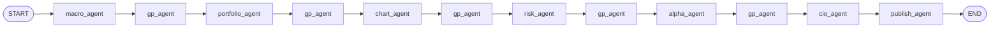

# AlphaInvest 코드베이스 개요

이 문서는 저장소 내 **주요 `.py` 모듈**의 역할과, 애플리케이션 **전체 실행 흐름**을 한곳에서 파악하기 위한 참고용 요약입니다.

---

## 1. 한눈에 보는 실행 흐름

애플리케이션의 기본 경로는 **LangGraph**로 정의됩니다. `main.py`가 `build_skeleton()`으로 컴파일된 그래프를 스트리밍 실행합니다.

```mermaid
flowchart LR
  START([START]) --> Macro[macro_agent]
  Macro --> GP1[gp_agent]
  GP1 --> Portfolio[portfolio_agent]
  Portfolio --> GP2[gp_agent]
  GP2 --> Chart[chart_agent]
  Chart --> GP3[gp_agent]
  GP3 --> Risk[risk_agent]
  Risk --> GP4[gp_agent]
  GP4 --> Alpha[alpha_agent]
  Alpha --> GP5[gp_agent]
  GP5 --> CIO[cio_agent]
  CIO --> Publish[publish_agent]
  Publish --> END([END])
```

- **분석 순서**: Macro → Portfolio → **Chart** → Risk → Alpha → CIO → Publish  
- 각 분석 노드 **직후** 항상 **GP(검수/수정)** 노드로 들어가며, `gp_router`가 `last_node`를 보고 다음 분석 노드 또는 CIO로 분기합니다.  
- **Chart**는 yfinance 기술 신호·섹터 ETF 벤치마크·(선택) LLM 3개월 자산배분 서술로 `chart_result` / `chart_data`를 채우며, Risk·Alpha·CIO 맥락에 사용됩니다.  
- CIO는 거시·포트·차트·리스크·알파를 합쳐 `final_report`를 만들고, Publish가 Notion에 올려 `notion_page_url`을 채웁니다.

---

## 2. 디렉터리와 책임

| 경로 | 역할 |
|------|------|
| `main.py` | CLI 진입점, `.env` 로드, 초기 state 생성, 그래프 스트림·로깅 |
| `agents/` | LangGraph 상태·상수·워크플로 정의 및 노드(에이전트) 구현 |
| `data/` | 외부 API 연동(LLM·FRED·yfinance·Tavily 등), 복합점수·벤치마크 유니버스·포트 해석 |
| `utils/` | 로깅, 주식/거시 보조, Notion 발행, 병렬·JSON·TTL 캐시·타이밍 |
| `dashboard/` | 로컬 HTTP 대시보드(HTML/JSON API), 보유 입력·매크로·시그널·리포트 잡 |
| `evaluations/` | CIO 리포트 정량·정성 평가 및 벤치마크 스크립트 |
| `tests/` | 단일 노드·캐시·병렬 유틸 스모크 |
| `JS_test/` | Risk 로직 실험·레거시 스냅샷 (본선은 `agents/nodes/risk*.py`) |

---

## 3. 파일별 요약

### 3.1 루트

| 파일 | 기능 요약 |
|------|-----------|
| **`main.py`** | `get_initial_state` + `get_portfolio()`로 초기 state 구성 후 `app.stream(...)`으로 전체 파이프라인 실행. 주요 결과 키별 진행 로그 출력. |

### 3.2 `agents/`

| 파일 | 기능 요약 |
|------|-----------|
| **`agents/constants.py`** | `StateKey`, `AgentName`(Chart 포함), `ModelConfig`. |
| **`agents/state.py`** | `AgentState`: `user_portfolio`, `fast_mode`, 각종 `*_messages`, `macro_result`/`macro_data`, `market_news_snippet`, **`chart_result`/`chart_data`**, `risk_result`, `alpha_result`, `portfolio_result`, `current_report`, `report_source_links`, `last_node`, `final_report`, `notion_page_url`. `get_initial_state()`. |
| **`agents/workflow.py`** | `build_skeleton()`: `START→Macro`, 분석 노드(Macro·Portfolio·**Chart**·Risk·Alpha) 각각 `→GP`, `GP→gp_router` → 다음 분석 또는 CIO, `CIO→Publish→END`. `gp_router`의 `phase_order`와 `conditional_edges` 대상 노드명을 **동시에** 맞출 것. |

#### `agents/nodes/`

| 파일 | 기능 요약 |
|------|-----------|
| **`macro.py`** | 거시 지표·뉴스 수집 후 LLM 거시 요약. `macro_result`, `macro_data`, `current_report`. |
| **`portfolio.py`** | 보유 시세 보강·맥락 구성 후 포트폴리오 진단 LLM. `portfolio_result`, `current_report`. |
| **`chart.py`** | `fetch_market_signals`로 보유+`sector_momentum_universe` 벤치마크 기술 신호, `compute_composite_scores_for_signals`, RSI/모멘텀 요약. `OPENAI_API_KEY` 있으면 벤치마크 기반 **3개월 자산배분 관점** 추천·위험 섹터 LLM 서술, 없으면 규칙 기반 요약. `chart_result`, `chart_data`, `current_report`. |
| **`risk.py`** | 엔트리: FRED·Tavily·시장 신호 등. 로직·페치·프롬프트는 **`risk_logic.py`**, **`risk_fetchers.py`**, **`risk_prompts.py`** 등과 협력. `risk_result`, `current_report`. |
| **`alpha.py`** | 뉴스 기반 테마·알파 리포트 LLM. `alpha_result`, `current_report`. |
| **`gp.py`** | GP JSON 심사·반려 시 `run_repair_chain`. |
| **`gp_helpers.py`** | `GPFeedback`, `get_target_key`, `run_repair_chain`. |
| **`cio.py`** | Macro·Portfolio·**Chart**·Risk·Alpha 초안 합성 후 LLM 정제. `final_report`. |
| **`publish.py`** | Notion 발행, `notion_page_url`. |

### 3.3 `data/`

| 파일 | 기능 요약 |
|------|-----------|
| **`fetchers.py`** | `get_llm`, `fetch_macro_data`, `fetch_stock_data`, `fetch_news`/`fetch_news_with_sources`, **`fetch_market_signals`**(다중 티커·스레드 풀) 등. |
| **`composite_score.py`** | 시그널 딕셔너리 기준 유니버스 횡단면 복합점수(Chart·대시보드 랭킹). |
| **`sector_momentum_universe.py`** | 섹터·지역·자산군 ETF 벤치마크 목록·라벨(`sector_momentum_symbols`, `label_for_symbol` 등). |
| **`portfolio_resolver.py`** | 대시보드/CLI 보유 문자열 파싱·state 행 변환. |
| **`market_signals.py`**, **`llm_client.py`**, **`news_source.py`**, **`macro_data_source.py`** | 시장 신호·LLM·뉴스·매크로 데이터 소스 모듈(페치 레이어 분리). |
| **`mock_data.py`** | 로컬/테스트용 포트폴리오. |

### 3.4 `utils/`

| 파일 | 기능 요약 |
|------|-----------|
| **`logger.py`** | `get_logger`, `LOG_LEVEL`. |
| **`helpers.py`** | 그래프 시각화, `parallel_map_*`, `parse_llm_json`. |
| **`stock_data.py`** | 티커 정보·`enrich_portfolio_data`. |
| **`macro_data.py`** | 매크로·섹터 컨텍스트 문자열. |
| **`notion_publisher.py`** | Notion 발행. |
| **`timing.py`** | 요청 구간 경과 시간 로깅. |
| **`ttl_cache.py`** | TTL 캐시 유틸. |
| **`timeout.py`** | 타임아웃 헬퍼. |

### 3.5 `dashboard/`

| 파일 | 기능 요약 |
|------|-----------|
| **`app.py`** | `ThreadingHTTPServer`(기본 `127.0.0.1:8000`), `/`, `/api/dashboard`, 리포트 잡 API 등. |
| **`data.py`** | 매크로·보유 시그널·섹터 프리뷰·뉴스 스니펫 등 **대시보드 payload** 조립. |
| **`render.py`**, **`render_sections.py`** | HTML 렌더. |
| **`reporting.py`** | 포트폴리오 리포트 빌드·파이프라인 연동. |
| **`jobs.py`**, **`job_runner.py`**, **`job_payloads.py`**, **`job_store.py`** | 백그라운드 리포트 잡 큐·상태·실행. |

### 3.6 `evaluations/`

| 파일 | 기능 요약 |
|------|-----------|
| **`run_eval.py`** | 샘플 로드, 그래프 `invoke`, 정량·정성 평가, 리포트 저장. |
| **`metrics/quant.py`**, **`metrics/qual.py`** | 정량 지표, LLM Judge 등. |

### 3.7 `tests/`

| 파일 | 기능 요약 |
|------|-----------|
| **`test_risk_node.py`**, **`test_portfolio.py`** | 노드 단독 스모크. |
| **`test_stock_data_parallel.py`**, **`test_ttl_cache.py`** | 병렬·캐시 등 유틸 테스트. |

### 3.8 `JS_test/` (레거시·실험)

| 파일 | 기능 요약 |
|------|-----------|
| **`risk_v01.py` ~ `risk_v03.py`** 등 | 초기 Risk 설계·실험. 본선은 `agents/nodes/risk*.py` 기준. |

---

## 4. 상태(`AgentState`)와 주요 키 흐름

| 키 | 채우는 노드 | 용도 |
|----|-------------|------|
| `user_portfolio` | 초기 state | 전 구간 입력 |
| `fast_mode` | (옵션) 초기/런타임 | 빠른 경로 등 |
| `macro_result` / `macro_data` | Macro | Portfolio, Risk, GP, Alpha, CIO |
| `market_news_snippet` | Macro 등 | 대시보드·스니펫 재사용 |
| `portfolio_result` | Portfolio | CIO, Alpha |
| **`chart_result` / `chart_data`** | **Chart** | Risk, Alpha, **CIO**, GP 검수용 `current_report` |
| `risk_result` | Risk | CIO, Alpha |
| `alpha_result` | Alpha | CIO |
| `current_report` | 각 분석 노드·GP | GP 검수 대상 |
| `report_source_links` | 노드별 누적 | 최종 리포트 출처 |
| `last_node` | 분석 노드 | `gp_router` 분기 |
| `final_report` | CIO | Publish |
| `notion_page_url` | Publish | 발행 URL |

---

## 5. 외부 연동·환경 변수 (개요)

- **OpenAI**: `OPENAI_API_KEY` — LLM 노드·GP·Chart(선택)·평가 Judge 등  
- **FRED**: `FRED_API_KEY` — 거시 시계열  
- **Tavily**: `TAVILY_API_KEY` — 뉴스 검색  
- **Notion**: `NOTION_API_KEY`, `NOTION_DATABASE_ID` — 페이지 생성  
- **로깅**: `LOG_LEVEL` (선택)

---

## 6. 유지보수 시 참고

- **파이프라인 순서 변경**: `agents/workflow.py`의 **`phase_order`**, 분석 노드 `agents` 리스트, `add_conditional_edges`의 **라우팅 맵**을 함께 수정해야 합니다.  
- **Risk**: 본선은 여러 `risk_*.py`로 분리되어 있으므로 수정 시 import·책임 범위를 확인합니다.  
- **Chart·벤치마크**: `data/sector_momentum_universe.py`의 ETF 목록이 Chart·대시보드 섹터 프리뷰에 공통으로 영향합니다.  
- **평가**: `evaluations/run_eval.py`는 `build_skeleton()`과 샘플 JSON을 전제로 합니다.  
- **대시보드**: `python -m dashboard.app` — 기본 `http://127.0.0.1:8000` (첫 로드 시 외부 API로 수 초~10초 이상 걸릴 수 있음).

---

*파일 추가·이동 시 이 문서를 함께 갱신하는 것이 좋습니다.*
