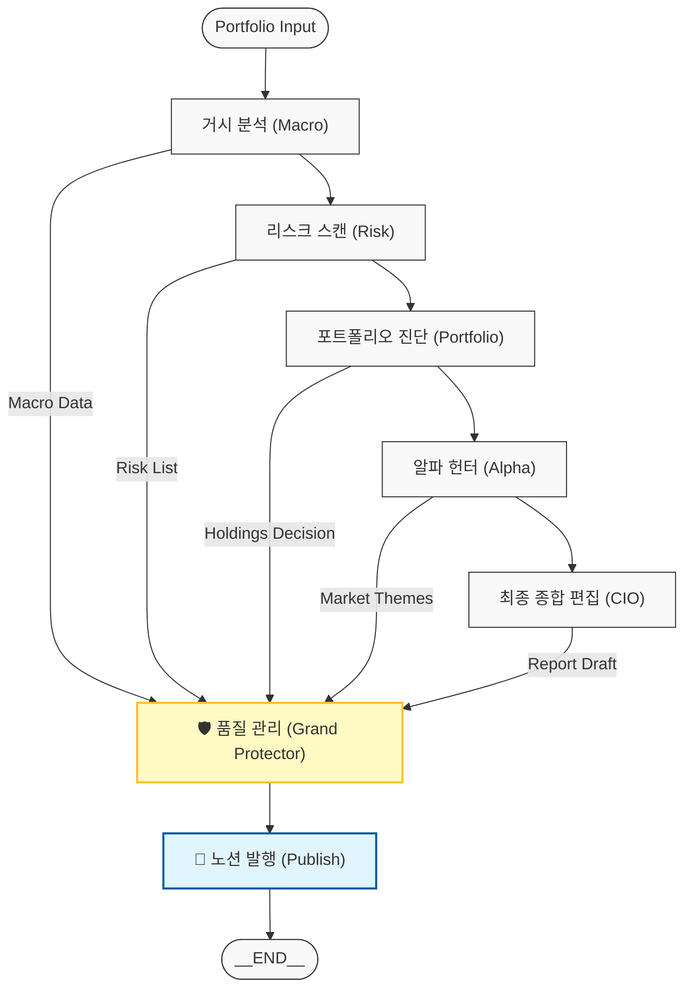

## 📊 AlphaInvest Architecture Flow (Consolidated Audit Model)

AlphaInvest는 각 전문 에이전트가 시장 데이터를 분석하고, 최종적으로 **품질 관리(GP)** 노드에서 모든 데이터를 교차 검증하여 리포트의 신뢰성을 확보하는 구조로 설계되었습니다.

### 🛡️ 품질 관리(GP) 노드의 역할
1.  **전역 상태 감사:** 모든 에이전트(Macro ~ Alpha)가 생성한 원천 데이터와 최종 리포트 초안을 대조합니다.
2.  **팩트 체크 및 논리 검증:** 리포트 내부의 수치 정합성과 섹션 간 논리적 일관성을 최종 확인합니다.
3.  **직접 수리 (Auto-Repair):** 결함 발견 시 CIO에게 되돌려보내지 않고 GP가 직접 문장을 수정하여 지연 없이 최종본을 확정합니다.

---
*Last Updated: 2026-03-26*
