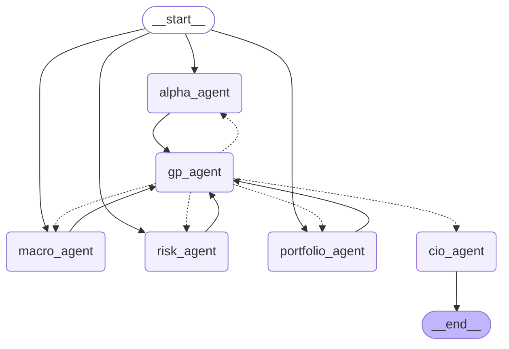

## 📊 AlphaInvest Architecture Flow

```mermaid
graph TD;
	__start__([__start__]):::first
	macro_agent(macro_agent)
	risk_agent(risk_agent)
	alpha_agent(alpha_agent)
	portfolio_agent(portfolio_agent)
	gp_agent(gp_agent)
	cio_agent(cio_agent)
	__end__([__end__]):::last
	__start__ --> alpha_agent;
	__start__ --> macro_agent;
	__start__ --> portfolio_agent;
	__start__ --> risk_agent;
	alpha_agent --> gp_agent;
	gp_agent -.-> alpha_agent;
	gp_agent -.-> cio_agent;
	gp_agent -.-> macro_agent;
	gp_agent -.-> portfolio_agent;
	gp_agent -.-> risk_agent;
	macro_agent --> gp_agent;
	portfolio_agent --> gp_agent;
	risk_agent --> gp_agent;
	cio_agent --> __end__;
	classDef default fill:#f2f0ff,line-height:1.2
	classDef first fill-opacity:0
	classDef last fill:#bfb6fc

```
